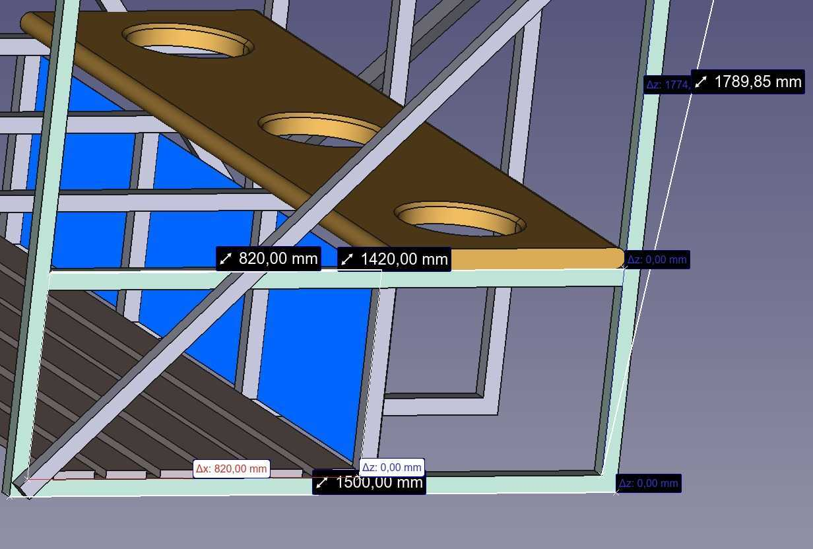
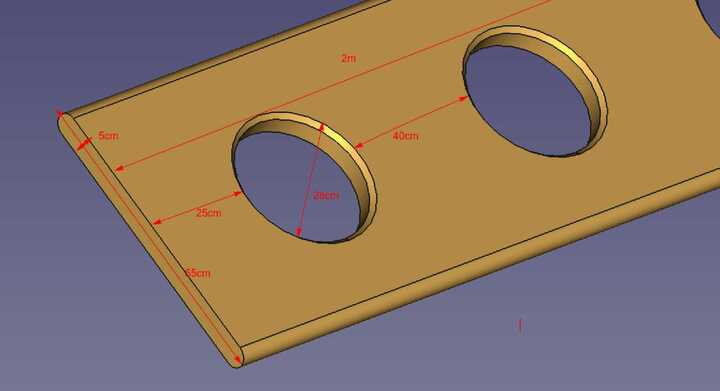

# latryna
projekt latrýny pro skautský tábor ve FreeCad

[visualizace](https://vaclavrak.github.io/latryna/KONSTRUKCE.html)

rozpočet cca 30tis Kč

| Položka                  | Cena s DPH (Kč) |
|--------------------------|-----------------|
| **celkem**               | **7 600 Kč**    |
| jekly                    |   2 900 Kč      |
| spojovací materiál       |     340 Kč      |
| latě 12 m                |     270 Kč      |
| prkna 8×2 m              |     360 Kč      |
| trapez plast 3 m×1 m 3ks | 3 146 Kč        |

### jekl 30x30x2
| **počet** |       |        **délka [mm]**                        | délka celkem [mm]       | 38320                   |
|-----------|------------------------|-----------------------|-------------------------|----------------|
| 4x        | spodní díl             | 1500                  | skosil obě strany 45 ̊  | 6000 |
| 4x        | vchodový díl - svislý  | 2000                  | skosil jednu stranu 45° | 8000                   |
| 4x        | zadní díl - svislý     | 1800                  | skosil jednu stranu 45° | 7200                    |
| 4x        | přícný horitonální díl | 1440                  |                         | 5760                    |
| 4x        | podpěra                | 440                  |                         | 1760                    |
| 4x        | střecha                | 2400                  |                         | 9600                    |

délka celkem [mm] 8000

### jekl 40x20x2

| | | dékla ks [mm] | délka ceklem [mm] |
| -------------|-|---------------|-------------------| 
| 4x | spojovací tyč | 2000          | 8000              | 

## Koty

### Jekly

### Prkénko

